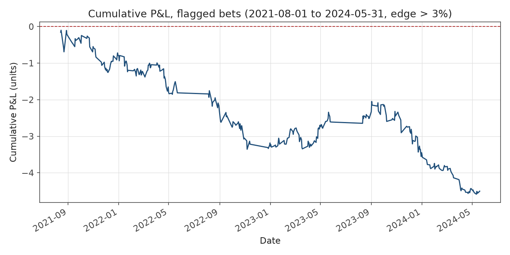
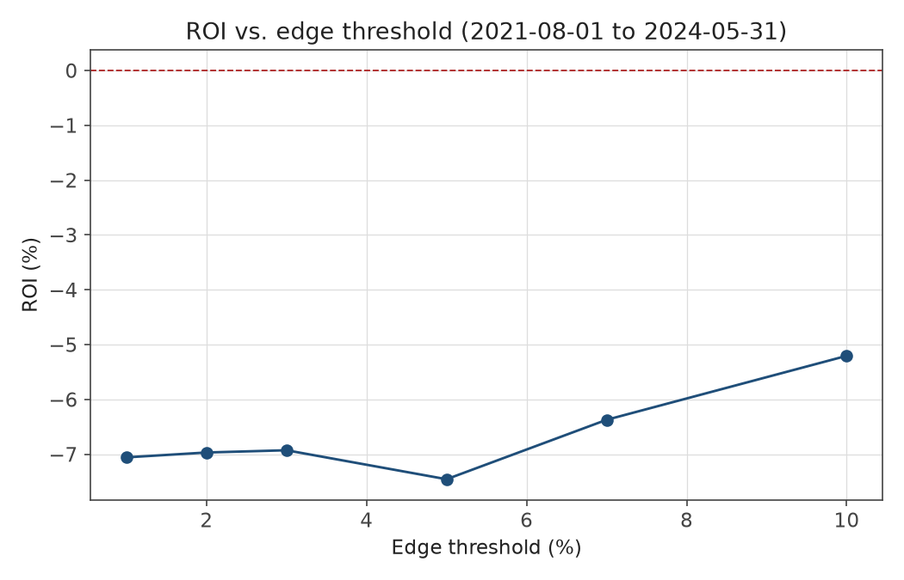

# ev-finder

I built a Dixon-Coles Poisson goals model for English Premier League matches, backtested it walk-forward against three seasons of Bet365 closing odds with a strict no-leak guarantee, and found that it loses money: -6.93% ROI on 1,821 flagged bets at a 3% edge threshold. That result holds up across every edge threshold I tried and is worse, not better, on the market (over/under 2.5 goals) where a Poisson model has the clearest theoretical case for an edge. The pipeline — live odds ingestion, historical data, the model, and the backtest harness — works end to end and is documented below. The finding is that a naive implementation of a 25+ year old public model doesn't beat Bet365's closing lines, which is itself the expected, useful result of doing this properly before risking money on it.



## Motivation

Football betting markets are a reasonable target for a modeling exercise because the underlying event (a match) reduces to a small number of countable outcomes (goals), there's a long public track record of models that work reasonably well (Dixon-Coles 1997 among them), and there's an unusually clean way to check your work: bookmaker closing lines. Closing odds, especially from a sharp, high-volume book like Bet365, are widely treated in the sports-betting literature as close to the best available estimate of true outcome probability — the market has absorbed information from everyone who bet before kickoff. That makes "beat the closing line" a much harder and more honest bar than "beat some soft book's opening price," and a much better test of whether a model has found real signal or is just fitting noise.

I picked Poisson/Dixon-Coles specifically because goals in a match are well-approximated by a low-count Poisson process, and Dixon-Coles' contribution — a small correlation correction (`rho`) on the low-scoring cells (0-0, 1-0, 0-1, 1-1) — fixes the one place a naive independent-Poisson model is known to misfire (plain independent Poisson underestimates how often low-scoring games end in a draw). It's a well-understood, well-published baseline, not something exotic, which makes it a fair test: if a clean implementation of a known-good model can't clear the bar, that's informative in itself.

I backtested before wiring anything into live betting recommendations on purpose. It's easy to write a model that looks good because it was accidentally trained on data from the future, or evaluated against the wrong odds, or graded by a metric that doesn't correspond to money won or lost. The only way I trust a result enough to act on it is to prove, mechanically, that the evaluation couldn't have cheated — which is what the walk-forward structure and the no-leak test below are for.

## Method

**Data.** Live odds come from [The Odds API](https://the-odds-api.com/) (free tier, 500 requests/month), stored raw with timestamps in SQLite. Historical results and closing odds come from [football-data.co.uk](https://www.football-data.co.uk/) — 6 EPL seasons (2019/20 through 2024/25, 2,280 matches), including Bet365 and Pinnacle closing odds for 1X2 and Bet365/market-average closing odds for over/under 2.5.

**Model.** Dixon-Coles (1997): each team gets a multiplicative attack strength and defense strength, fit jointly by maximum likelihood via `scipy.optimize`, with a fixed home-advantage multiplier and the `rho` low-score correlation term. Matches are time-weighted by an exponential decay (`xi = 0.0065`/day) so recent form matters more than results from years ago. Attack strengths are normalized to sum to the number of teams for identifiability — an arbitrary but necessary scale choice, since the model's actual predictions are invariant to it. Fitted parameters produce a full scoreline probability grid, which collapses into 1X2, over/under 2.5, and BTTS market probabilities.

**Backtest.** Walk-forward, not train/test split: for every unique matchday from 2021-08-01 onward, the model is refit on all matches *strictly before* that date and used to predict only that day's fixtures, before rolling forward and refitting again. This is the only structure that matches how the model would actually be used live — it never sees a result before predicting it. That guarantee is enforced in code, not just by convention: `DixonColesModel.fit(matches, as_of_date)` filters to `date < as_of_date` before anything else touches the data, and [`tests/test_backtest_no_leak.py`](tests/test_backtest_no_leak.py) checks it by feeding the model deliberately poisoned future rows (impossible scorelines, a phantom team) dated on and after the cutoff and asserting the fitted parameters are bit-identical to a fit that never saw those rows at all. If that test passes, the future literally could not have leaked into the past, regardless of what a subtler off-by-one bug might otherwise have let through.

**Vig removal and staking.** Bookmaker odds are converted to fair probabilities with the multiplicative method (implied probabilities normalized to sum to 1) before comparing to the model — otherwise you're partly just measuring the bookmaker's margin, not their forecast. A bet is flagged when `model_prob - market_prob_no_vig` exceeds an edge threshold (default 3%), sized with fractional Kelly (default quarter-Kelly, i.e. 0.25x the mathematically optimal stake) to control variance against model error.

## Findings

Over the walk-forward backtest window (2021-08-01 to 2024-05-31, 3 full seasons), the model lost money on every cut of the data I looked at.

| | |
|---|---|
| Total bets | 1,821 |
| ROI | **-6.93%** |
| Hit rate | 44.3% |
| Max drawdown | 4.62 units |

Split by market, it's worse on 1X2 (-9.07% ROI) than on totals (-5.00% ROI) — notable because over/under 2.5 is exactly where a goals-based Poisson model has the strongest theoretical claim to an edge (it's a direct model of the thing being bet on, rather than a derived comparison of two teams' relative strength). It wasn't better there. It also isn't a threshold artifact: I re-ran the backtest at six edge thresholds from 1% to 10%, and ROI stayed negative throughout, ranging from -5.21% to -7.46% with no threshold anywhere near break-even.



Full breakdowns — by season, by market, by edge threshold — are in [RESULTS.md](RESULTS.md).

My honest read: this is what a naive model should look like against sharp closing lines, not a bug to chase. Bet365's closing odds already incorporate everything my model incorporates (recent results, home advantage, goal-scoring correlation) plus everything it doesn't (injuries, lineup news, weather, market money flow). Beating them with a Poisson model and public results data alone would be the surprising outcome, not this one. The interesting question was never really "can I beat Bet365's closing line with public data and a public model" — it's closer to being a null result by construction. The more useful questions are downstream of accepting that: whether the model is *closer* to the closing line than a naive baseline (measurable via CLV even without beating the line outright), whether softer books post worse lines than Bet365 that a legitimate signal could clear, and whether specific markets or situations (not the aggregate) hide a real edge.

## Next steps

- **CLV analysis.** ROI against the closing line answers "would this have made money"; closing-line value (how favorable the price taken was relative to where the line closed, independent of the bet's actual outcome) answers "is the model's signal any good at all," and is a lower-variance, faster way to iterate than waiting on win/loss outcomes. Worth computing even though the headline ROI is negative.
- **Multi-book comparison.** The backtest only checks Bet365, one of the sharpest books. Comparing model probabilities against softer European/Asian books' closing lines would test whether the edge (if any) is bookmaker-specific rather than nonexistent.
- **Over/under 2.5, specifically.** It underperformed 1X2 here, which is itself worth understanding rather than shrugging off — is the Poisson goal-count assumption too rigid, is `rho` mis-calibrated for the totals market, or is there a staking/threshold interaction I haven't isolated?
- **`find-value` stays unwired.** Given these results, wiring the model into live betting recommendations isn't justified yet. That's a deliberate scope decision, not a missing feature.

## Repo structure

```
src/ev_finder/
├── odds/          # live odds ingestion (The Odds API) -> SQLite
├── historical/     # historical results + closing odds (football-data.co.uk) -> SQLite
├── model/          # Dixon-Coles Poisson goals model (dixon_coles.py)
├── backtest/       # walk-forward backtest engine, Kelly staking
├── ev/             # vig removal
├── tracking/        # (unbuilt) live bet logging, CLV/ROI tracking
├── cli.py           # Typer CLI: fetch-odds, ingest-historical, backtest, ...
├── db.py            # SQLite schema
└── config.py         # .env / settings loading

scripts/
└── generate_report.py  # regenerates RESULTS.md and the two charts above

tests/                # pytest: vig math, Dixon-Coles fit/tau, Kelly staking, no-leak guarantee
assets/               # charts embedded in this README
RESULTS.md            # full numeric breakdown (by season, market, threshold)
```

## Setup

Requires [uv](https://docs.astral.sh/uv/) and Python 3.11+.

```bash
uv sync
cp .env.example .env   # set ODDS_API_KEY (free key from the-odds-api.com)
```

```bash
uv run ev-finder fetch-odds                                    # live EPL odds -> SQLite
uv run ev-finder ingest-historical --seasons 2019-2024          # historical results + odds -> SQLite
uv run ev-finder backtest --start 2021-08-01 --end 2024-05-31   # walk-forward backtest
```

`make test` / `make lint` / `make format` run pytest / ruff check / ruff format. `uv run python scripts/generate_report.py` regenerates `RESULTS.md` and the charts above from the live database.
